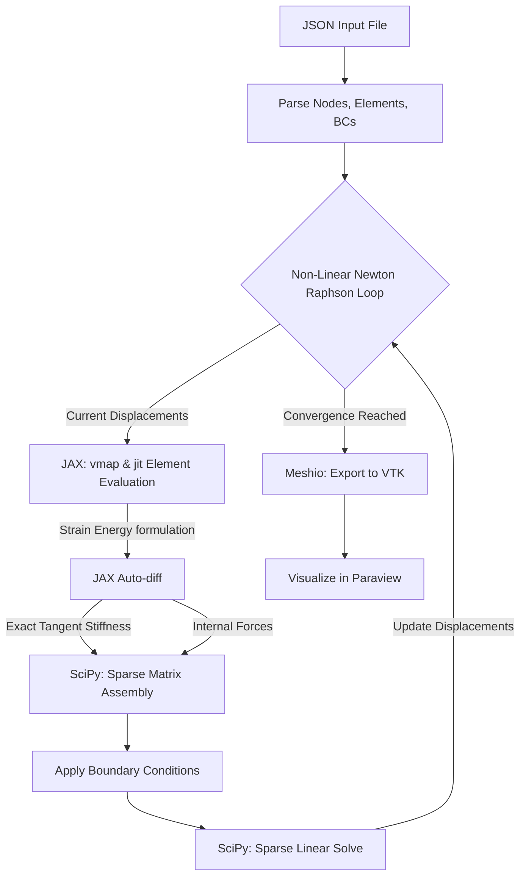
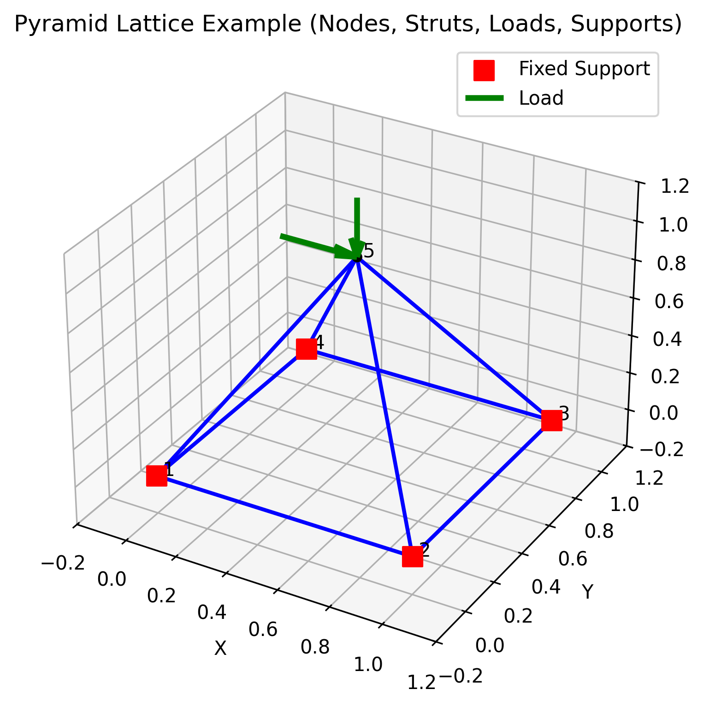

# 3D Beam Finite Element Lattice Simulator

A high-performance Python-based 3D beam finite element simulator designed specifically for large-scale lattice structures.

This simulator leverages **JAX** for automatic differentiation and Just-In-Time (JIT) compilation, combined with **SciPy**'s sparse matrix solvers. This architecture allows it to assemble and solve systems with thousands of beams at C++ speeds while remaining highly extensible for future non-linear research (geometric and material non-linearities).

## Features

- **JAX-Accelerated Physics Engine:** Element strain energy is formulated analytically, while Internal Forces and Tangent Stiffness Matrices are derived automatically using exact JAX automatic differentiation (`jax.grad` and `jax.hessian`).
- **Vectorized Assembly:** Solves eliminate the standard Python `for`-loop bottleneck. Element operations are batched using `jax.vmap` and mapped directly into SciPy sparse COO matrices.
- **Newton-Raphson Solver:** Implements a rigorous non-linear solver loop using sparse matrix reduction for Dirichlet boundary conditions.
- **JSON Input Structure:** Clean and intuitive input definition for nodes, elements, boundary conditions, and loads.
- **Paraview Integration:** Exports deformed topologies natively to VTK/VTU format via `meshio`.

### System Architecture



## Installation

This project uses `pyproject.toml` and is compatible with modern Python package managers like `uv` or `pip`.

### Using `uv` (Recommended)
```bash
# Install the environment
uv sync

# Activate the virtual environment
source .venv/bin/activate
```

### Using standard `pip`
```bash
python -m venv venv
source venv/bin/activate
pip install -e .
```

## Usage

### 1. Define your model
Create a `.json` file representing your lattice structure (see `lattice.json` for an example):

<p align="center">
  
</p>

```json
{
  "materials": [{"id": 1, "E": 210e9, "nu": 0.3, "model": "linear_elastic"}],
  "sections": [{"id": 1, "A": 0.01, "Iy": 1e-5, "Iz": 1e-5, "J": 2e-5}],
  "nodes": [{"id": 1, "coords": [0.0, 0.0, 0.0]}, {"id": 2, "coords": [1.0, 0.0, 0.0]}],
  "elements": [{"id": 1, "nodes": [1, 2], "material": 1, "section": 1}],
  "boundary_conditions": [
    {"node": 1, "dof": ["ux", "uy", "uz", "rx", "ry", "rz"], "value": 0.0}
  ],
  "point_loads": [
    {"node": 2, "dof": "fz", "value": -1000.0}
  ]
}
```

### 2. Run the simulation
You can run the sample simulation script directly:
```bash
python -m src.main
```
This will parse `lattice.json`, assemble the system, solve for displacements, and generate an `output.vtu` file.

### 3. Visualize
Drag and drop the generated `output.vtu` file directly into **Paraview**. You can apply the "Warp By Vector" filter to visualize the deformed structure in 3D.

## Running Tests

To ensure the physical validity of the solver, the framework includes a suite of tests validating the JAX finite element output against classical Euler-Bernoulli analytical solutions for Cantilever beams in 3D space.

To run the tests, install the development dependencies and run `pytest`:

```bash
# Using uv
uv sync --extra dev

# Using pip
pip install -e ".[dev]"

# Run tests
PYTHONPATH=. pytest tests/test_physics.py -v
```

## Architecture for Non-Linearities
Because this simulator utilizes JAX for Automatic Differentiation, extending it to support large deformations (Geometric non-linearity) or hyperelasticity (Material non-linearity) does not require manual derivation of complex 12x12 tangent stiffness matrices. You only need to update the strain energy formulation in `src/beam.py`, and the JAX engine will automatically handle the derivatives and non-linear convergence loop!

## License
MIT License
